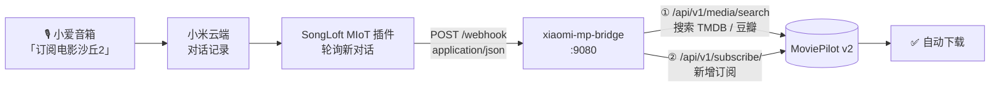

# xiaomi-mp-bridge

> 用嘴订阅电影 —— 一句话让小爱音箱帮你把片子加进 MoviePilot。

`xiaomi-mp-bridge` 是一个超轻量的桥接服务：把 **小爱音箱** 的语音指令，经由 **SongLoft（小爱音箱接入插件）** 的 Webhook 推送，转换成 **MoviePilot v2** 的订阅请求。

躺在沙发上说一句「订阅电影沙丘2」，剩下的交给 NAS。

---

## 工作原理



**服务内部流程**

1. 接收 SongLoft 推送的 JSON，取出语音转写文本；
2. 正则解析意图，提取「片名 + 类型（电影 / 电视剧）」；
3. 调用 MoviePilot 搜索接口做模糊匹配，取最佳结果；
4. 调用订阅接口入库，返回人话结果。

---

## 特性

- **零依赖**：仅用 Python 3 标准库，无需 `pip install` 任何东西
- **极轻量**：基于 `python:3.12-alpine`，镜像小、启动快、内存占用约 20MB
- **意图容错**：支持「帮我订阅电影《沙丘2》」「订阅电视剧 三体」等多种口语说法
- **智能匹配**：优先精确命中标题，其次包含匹配，最后回退到搜索结果第一条
- **中文错误提示**：鉴权失败、已订阅、搜不到等场景都返回可读的中文说明
- **可选访问密钥**：`WEBHOOK_KEY` 防止局域网内被他人滥用
- **健康检查**：`GET /health` 便于接入 NAS 的容器健康监测

---

## 快速开始（飞牛 NAS / 任意 Docker 环境）

### 方式一：docker-compose（推荐）

1. 在 NAS 上创建目录并放入 `app.py`：

   ```bash
   mkdir -p /vol1/1000/docker/xiaomi-mp-bridge/app
   # 把仓库里的 app.py 上传到该目录
   ```

2. 修改 `docker-compose.yml` 中的环境变量（见下方[配置项](#配置项)），然后启动：

   ```bash
   docker compose up -d
   ```

3. 验证服务是否活着：

   ```bash
   curl http://192.168.5.3:9080/health
   # {"status": "ok", "ts": 1710000000}
   ```

### 方式二：本地构建镜像

```bash
docker build -t xiaomi-mp-bridge .
docker run -d --name xiaomi-mp-bridge \
  --network host \
  -e MP_BASE_URL=http://192.168.5.3:3000 \
  -e MP_TOKEN=你的MoviePilot令牌 \
  -e TZ=Asia/Shanghai \
  xiaomi-mp-bridge
```

> 默认使用 `network_mode: host`，容器直接占用宿主机 `9080` 端口，无需端口映射。
> 若改为 bridge 模式，记得加 `-p 9080:9080`。

---

## 配置项

全部通过环境变量注入：

| 变量 | 必填 | 默认值 | 说明 |
| :--- | :---: | :--- | :--- |
| `MP_BASE_URL` | ✅ | `http://127.0.0.1:3000` | MoviePilot 访问地址，如 `http://192.168.5.3:3000` |
| `MP_TOKEN` | ✅ | 空 | MoviePilot API 令牌：**设置 → 系统 → 基础设置 → API令牌** |
| `PORT` | ❌ | `9080` | 本服务监听端口 |
| `TV_SEASON` | ❌ | `1` | 剧集订阅的默认季数 |
| `WEBHOOK_KEY` | ❌ | 空 | Webhook 访问密钥，配置后需带 `?key=xxx` 访问 |
| `TZ` | ❌ | `Asia/Shanghai` | 时区，影响日志时间 |

> ⚠️ `MP_TOKEN` 必须通过 `X-API-KEY` 请求头传递。MoviePilot v2 会把 `Authorization: Bearer` 当 JWT 解析，用错头会直接 401。本服务已正确处理。

---

## SongLoft 配置

在 SongLoft 的 MIoT 插件 Webhook 设置中填写：

```
http://<你的内网IP>:9080/webhook
```

例如：

```
http://192.168.5.3:9080/webhook
```

若设置了 `WEBHOOK_KEY`：

```
http://192.168.5.3:9080/webhook?key=你设置的密钥
```

**注意事项**

- 手机与小爱音箱需和 NAS 在**同一局域网**，否则插件推不过来；
- 建议给 NAS 设置**静态 IP / DHCP 保留**，避免重启后 Webhook 地址失效；
- 插件通过轮询检测新对话，通常有几秒延迟，属正常现象。

---

## 语音指令示例

| 说法 | 解析结果 |
| :--- | :--- |
| 订阅电影沙丘2 | 电影《沙丘2》 |
| 帮我订阅一部电影《流浪地球3》 | 电影《流浪地球3》 |
| 订阅电视剧 三体 | 电视剧《三体》（默认第 1 季） |
| 订阅美剧 权力的游戏 | 电视剧《权力的游戏》 |
| 订阅《奥本海默》 | 电影《奥本海默》 |
| 订阅这部电影沙丘 | 电影《沙丘》 |

解析不到订阅意图的对话会被静默忽略，不会打扰你。

---

## 手动测试

不用等小爱音箱，直接发一条模拟推送验证链路：

```bash
curl -X POST http://192.168.5.3:9080/webhook \
  -H "Content-Type: application/json" \
  -d '{
    "messages": [
      {
        "message": {
          "response": {
            "answer": [
              { "question": "订阅电影沙丘2" }
            ]
          }
        }
      }
    ]
  }'
```

成功响应：

```json
{
  "code": 0,
  "results": [
    {
      "spoken": "订阅电影沙丘2",
      "title": "沙丘2",
      "type": "movie",
      "matched": { "title": "沙丘2", "year": "2024", "type": "电影", "tmdb_id": 693134 },
      "status": "ok",
      "message": "订阅成功：沙丘2"
    }
  ]
}
```

---

## 故障排查

| 现象 | 原因与处理 |
| :--- | :--- |
| `无法连接 MoviePilot` | 检查 `MP_BASE_URL` 是否正确、NAS 防火墙是否放行、容器网络模式是否为 host |
| `MoviePilot 鉴权失败` | `MP_TOKEN` 与 MoviePilot 后台的 API 令牌不一致，重新复制一次 |
| `「XXX」已在订阅列表中` | 已经在库里了，无需重复订阅 |
| `未搜索到「XXX」` | 片名不够准确，试试完整中文名或英文原名 |
| 小爱说话没反应 | ① 先 `curl /health` 确认服务在线；② 确认 Webhook 地址端口正确；③ 看容器日志 `docker logs xiaomi-mp-bridge` |
| Webhook 返回 403 | 设置了 `WEBHOOK_KEY` 但 URL 里没带 `?key=` |

查看实时日志：

```bash
docker logs -f xiaomi-mp-bridge
```

---

## 目录结构

```
xiaomi-mp-bridge/
├── app.py               # 主服务（零依赖，标准库实现）
├── docker-compose.yml   # 飞牛 NAS / Docker Compose 部署文件
├── Dockerfile           # 可选：自行构建镜像
├── .gitignore
├── LICENSE
└── README.md
```

---

## 许可

[MIT License](./LICENSE) — 随便用，出问题不负责。
